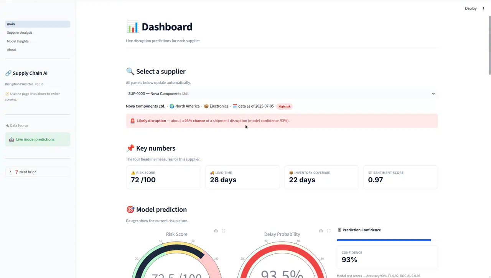
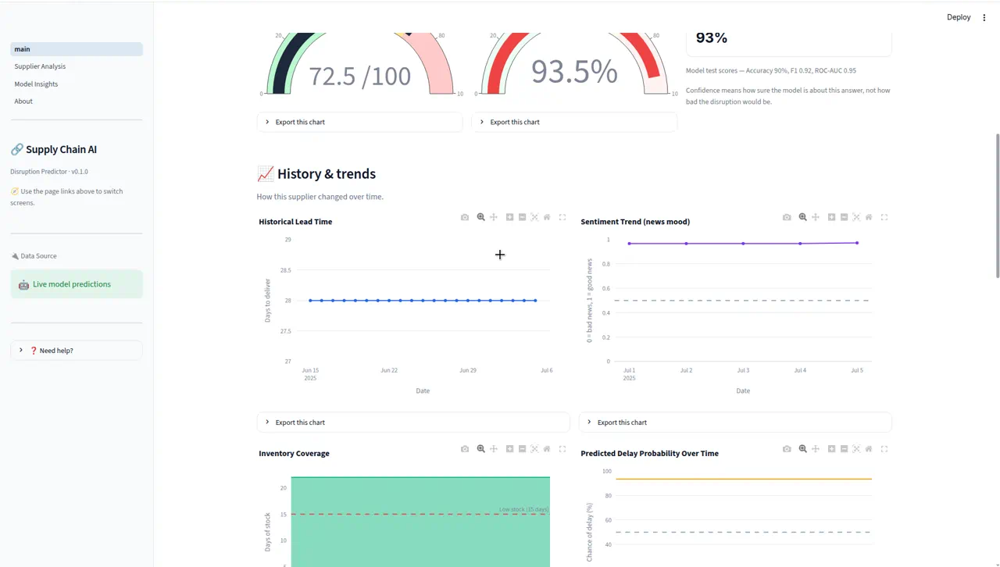
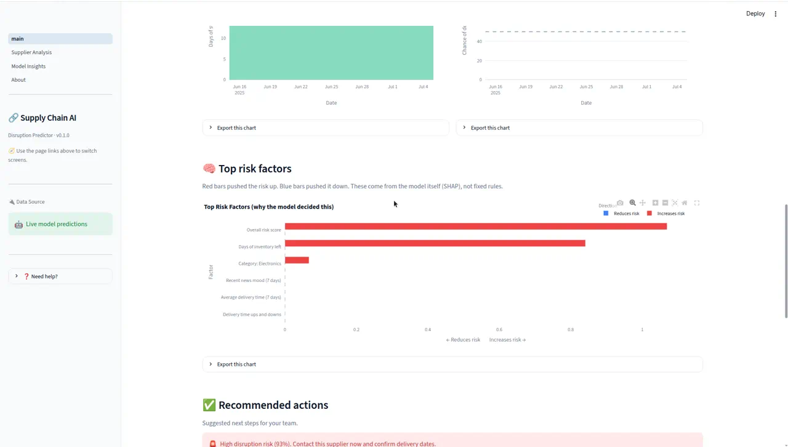
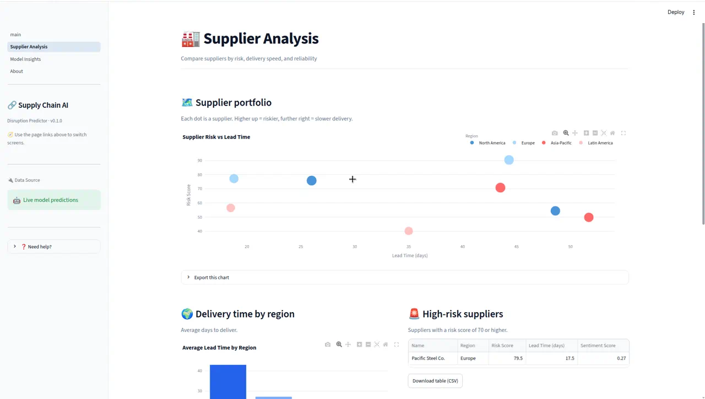
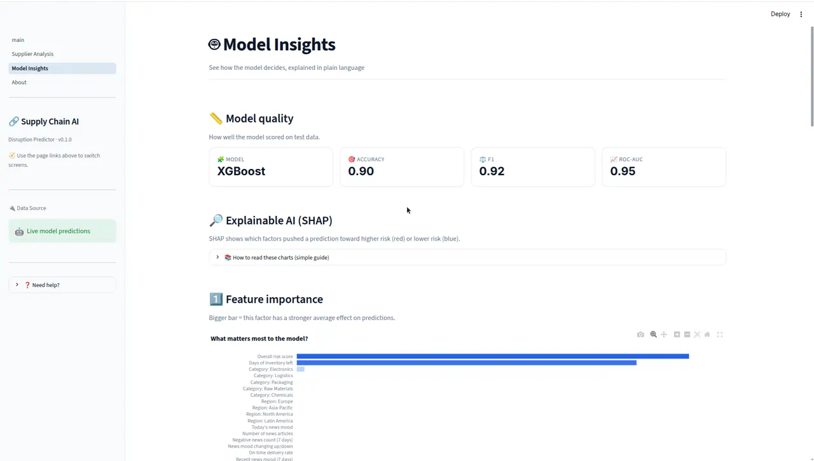
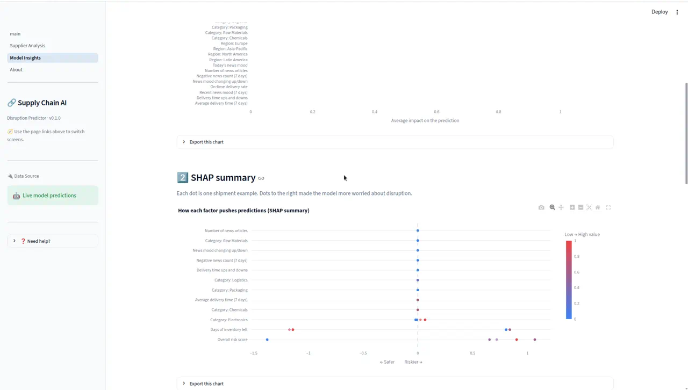
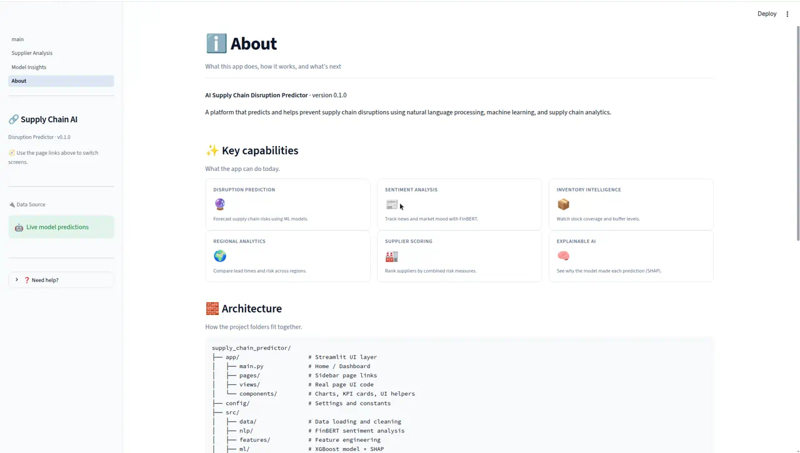

# 🔗 AI Supply Chain Disruption Predictor

> An end-to-end machine learning platform that predicts shipment disruptions before they happen — combining financial NLP, gradient boosting, and explainable AI in an interactive Streamlit dashboard.

[](https://www.python.org/)
[](https://streamlit.io/)
[](https://xgboost.readthedocs.io/)
[](https://shap.readthedocs.io/)
[](LICENSE)

---

## 📋 Table of Contents

- [Project Overview](#-project-overview)
- [Screenshots](#-screenshots)
- [Architecture](#-architecture)
- [Folder Structure](#-folder-structure)
- [Technologies](#-technologies)
- [Installation](#-installation)
- [Model Explanation](#-model-explanation)
- [Business Value](#-business-value)
- [Future Improvements](#-future-improvements)
- [Resume Bullets](#-resume-bullets)
- [License](#-license)

---

## 🎯 Project Overview

Supply chain disruptions cost enterprises billions annually, and the warning signs — lengthening lead times, thinning inventory buffers, deteriorating supplier news sentiment — are usually visible *before* a shipment actually fails. The problem is that these signals live in separate systems and nobody connects them in time.

**AI Supply Chain Disruption Predictor** unifies those signals into a single decision surface. It ingests supplier performance data, scores news articles with a finance-tuned transformer, engineers time-series risk features, trains a gradient-boosted classifier, and surfaces every prediction with a plain-language explanation of *why* the model reached its conclusion.

### What it does

| Capability | Description |
|------------|-------------|
| 🔮 **Disruption prediction** | XGBoost classifier estimates the probability that a supplier's shipment will be disrupted |
| 📰 **Financial NLP** | FinBERT scores supplier news into sentiment labels, confidence, and a 0–1 numeric score |
| 📊 **Feature engineering** | Vectorized rolling windows for lead time, variance, sentiment velocity, and negative news volume |
| 🧠 **Explainable AI** | SHAP feature importance, summary, and waterfall plots translated into non-technical language |
| ✅ **Prescriptive actions** | Converts predictions into concrete next steps (reorder, dual-source, escalate) |
| 📥 **Reporting** | One-click Markdown/CSV prediction reports and PNG/HTML chart exports |

### Who it's for

Supply chain managers, procurement teams, and operations analysts who need to move from **reactive firefighting** to **proactive risk mitigation**.

### Current model performance

| Metric | Score |
|--------|-------|
| Accuracy | **0.90** |
| Precision | **0.92** |
| Recall | **0.92** |
| F1 Score | **0.92** |
| ROC-AUC | **0.95** |
| Cross-validated accuracy | **0.93 ± 0.01** |

> ⚠️ **Note on labels:** The bundled sample dataset has no historical disruption outcomes, so the target variable is generated from documented business rules with injected label noise. Metrics demonstrate that the **pipeline is correct and reproducible** — they are not a claim about real-world predictive accuracy. Swap in a `disruption` column with true historical outcomes to obtain production-meaningful scores.

---

## 📸 Screenshots

### Dashboard — Live per-supplier predictions

Select any supplier and every panel updates: risk gauge, delay probability, confidence, KPI cards, and a colored risk banner.



### Dashboard — Historical trends

Four synchronized time-series views: lead time, news sentiment, inventory coverage (with a low-stock threshold line), and the model's predicted delay probability over time.



### Dashboard — Risk drivers and recommended actions

SHAP-derived risk factors (red raises risk, blue lowers it), paired with prioritized, plain-language recommendations.



### Supplier Analysis — Portfolio comparison

Risk-versus-lead-time scatter plot, regional delivery benchmarks, and a filtered high-risk supplier register.



### Model Insights — Global feature importance

Model quality metrics alongside mean absolute SHAP values, showing which inputs drive predictions overall.



### Model Insights — SHAP summary

Beeswarm-style distribution where each point is a single prediction; horizontal position shows risk contribution and color encodes the underlying feature value.



### About — Project documentation

In-app capability overview, architecture reference, and setup instructions.



---

## 🏗 Architecture

The system is a layered pipeline. Each stage writes a durable artifact, so any stage can be rerun, inspected, or replaced independently.

```
┌─────────────────────────────────────────────────────────────────────────┐
│                            DATA SOURCES                                 │
│   data/raw/supply_chain.csv          data/raw/news_articles.csv         │
│   (supplier performance metrics)      (supplier news coverage)          │
└───────────────┬─────────────────────────────────┬───────────────────────┘
                │                                 │
                ▼                                 ▼
┌───────────────────────────────┐   ┌─────────────────────────────────────┐
│      INGESTION LAYER          │   │           NLP LAYER                 │
│      src/data/                │   │           src/nlp/                  │
│                               │   │                                     │
│  • data_loader.py             │   │  • sentiment.py                     │
│    Schema validation          │   │    FinBERT (ProsusAI/finbert)        │
│  • preprocessing.py           │   │    → label, confidence, score       │
│    Date parsing, imputation   │   │    → daily aggregation per supplier │
└───────────────┬───────────────┘   └─────────────────┬───────────────────┘
                │                                     │
                │        cleaned DataFrame            │  daily_supplier_sentiment.csv
                └──────────────┬──────────────────────┘
                               ▼
              ┌──────────────────────────────────────────┐
              │        FEATURE ENGINEERING LAYER         │
              │        src/features/                     │
              │                                          │
              │  Join key: supplier_id + date            │
              │  Vectorized pandas rolling windows:      │
              │   • rolling_lead_time_7d                 │
              │   • lead_time_variance_7d                │
              │   • inventory_coverage                   │
              │   • supplier_reliability                 │
              │   • rolling_sentiment_7d                 │
              │   • sentiment_velocity                   │
              │   • negative_news_count_7d               │
              │                                          │
              │  → data/processed/ml_features.csv        │
              └────────────────────┬─────────────────────┘
                                   ▼
              ┌──────────────────────────────────────────┐
              │        MACHINE LEARNING LAYER            │
              │        src/ml/                           │
              │                                          │
              │  model.py                                │
              │   • Stratified 80/20 train/test split    │
              │   • 5-fold StratifiedKFold CV            │
              │   • GridSearchCV hyperparameter tuning   │
              │   • Accuracy / Precision / Recall /      │
              │     F1 / ROC-AUC evaluation              │
              │   • joblib persistence                   │
              │                                          │
              │  explainability.py                       │
              │   • SHAP TreeExplainer                   │
              │   • Human-readable feature name mapping  │
              │                                          │
              │  → models/disruption_xgb.joblib          │
              └────────────────────┬─────────────────────┘
                                   ▼
              ┌──────────────────────────────────────────┐
              │           SERVICE LAYER                  │
              │           src/services/                  │
              │                                          │
              │  • prediction_service.py                 │
              │    Per-supplier inference, history,      │
              │    risk factors, recommended actions     │
              │  • report_service.py                     │
              │    Markdown / CSV report generation      │
              │  • analytics_service.py                  │
              │    Aggregate portfolio analytics         │
              └────────────────────┬─────────────────────┘
                                   ▼
              ┌──────────────────────────────────────────┐
              │        PRESENTATION LAYER (app/)         │
              │                                          │
              │  main.py ──────────► Dashboard (home)    │
              │  pages/  ──────────► Sidebar page links  │
              │  views/  ──────────► OOP page classes    │
              │                      (BasePage ABC)      │
              │  components/ ──────► ChartFactory,       │
              │                      UI helpers, KPI     │
              └──────────────────────────────────────────┘
```

### Design principles

**Separation of concerns.** The UI layer (`app/`) never touches raw files. It talks only to services, which talk to the ML and data layers. Swapping the data source or the model requires no UI changes.

**Dependency injection.** Every page receives its analytics service and chart factory through its constructor, defaulting to sensible instances. This keeps pages testable in isolation.

**Object-oriented pages.** All four screens inherit from an abstract `BasePage`, which supplies a consistent header, shared services, and top-level error handling — so a failure in one section never blanks the whole page.

**Provider abstraction.** `PlaceholderDataProvider` and `CsvDataProvider` expose an identical interface, so the app runs with synthetic data or real CSVs interchangeably.

**Factory pattern for charts.** `ChartFactory` centralizes all Plotly styling, guaranteeing visual consistency across every chart in the app.

**Vectorized computation.** All rolling features use `groupby().rolling()` rather than Python loops, keeping feature engineering fast as data volume grows.

---

## 📂 Folder Structure

Every source file opens with a plain-language docstring and carries inline comments explaining each meaningful line.

```
ai-supply-chain-disruption-predictor/
│
├── app/                                  # 🖥 Streamlit presentation layer
│   ├── main.py                           # Entry point → Dashboard (home page)
│   ├── page_setup.py                     # Shared sidebar, global CSS, page config
│   ├── pages/                            # Streamlit multipage sidebar links
│   │   ├── 1_Supplier_Analysis.py         # Thin wrapper → views/supplier_analysis
│   │   ├── 2_Model_Insights.py            # Thin wrapper → views/model_insights
│   │   └── 3_About.py                     # Thin wrapper → views/about
│   ├── views/                            # Real page logic (OOP classes)
│   │   ├── base_page.py                  # Abstract base: header + error boundary
│   │   ├── dashboard.py                  # Live predictions, gauges, actions, reports
│   │   ├── supplier_analysis.py          # Portfolio comparison and registries
│   │   ├── model_insights.py             # SHAP explainability screens
│   │   └── about.py                      # Project documentation page
│   └── components/                       # Reusable UI building blocks
│       ├── charts.py                     # ChartFactory — all Plotly figures
│       ├── kpi_cards.py                  # KPI metric card renderer
│       ├── sidebar.py                    # Sidebar branding component
│       └── ui.py                         # Section headers, empty states,
│                                         #   safe_section(), chart/table export
│
├── config/                               # ⚙️ Application configuration
│   ├── __init__.py
│   └── settings.py                       # App title, version, page list, KPI labels
│
├── src/                                  # 🧠 Core business logic (backend)
│   ├── data/                             # Data ingestion and providers
│   │   ├── data_loader.py                # CSV loading + validation orchestration
│   │   ├── preprocessing.py              # Schema, date parsing, missing values
│   │   ├── csv_provider.py               # Real-CSV-backed data provider
│   │   └── placeholder_provider.py        # Seeded synthetic data provider
│   ├── nlp/                              # Natural language processing
│   │   └── sentiment.py                  # FinBERT scoring + daily aggregation
│   ├── features/                         # Feature engineering
│   │   └── feature_engineering.py        # Merge + vectorized rolling features
│   ├── ml/                               # Machine learning
│   │   ├── model.py                      # DisruptionPredictor (XGBoost pipeline)
│   │   └── explainability.py             # ShapExplainer + friendly naming
│   ├── models/                           # Domain models (typed dataclasses)
│   │   ├── metrics.py                    # KPIMetrics, SupplierRecord
│   │   └── sentiment.py                  # NewsArticle, ArticleSentimentResult
│   ├── services/                         # Orchestration layer
│   │   ├── prediction_service.py         # Live per-supplier inference + actions
│   │   ├── report_service.py             # Markdown / CSV report builders
│   │   └── analytics_service.py          # Aggregate analytics facade
│   └── utils/                            # Shared utilities
│       └── logging_config.py             # Structured console logging
│
├── scripts/                              # 🔧 Command-line pipelines
│   ├── run_sentiment.py                  # Step 1 — FinBERT sentiment analysis
│   ├── run_feature_engineering.py         # Step 2 — Build ML feature table
│   └── train_model.py                    # Step 3 — Train + evaluate + persist
│
├── data/
│   ├── raw/
│   │   ├── supply_chain.csv              # Sample supplier metrics
│   │   └── news_articles.csv             # Sample supplier news
│   └── processed/                        # Demo feature / sentiment CSVs (tracked)
│       ├── article_sentiment.csv          # Per-article FinBERT scores
│       ├── daily_supplier_sentiment.csv   # Daily aggregated sentiment
│       └── ml_features.csv               # ML-ready feature table
│
├── models/
│   └── disruption_xgb.joblib             # Demo trained model (tracked for deploy)
│
├── docs/screenshots/                     # README images
├── .streamlit/config.toml                # Streamlit theme configuration
├── requirements.txt                      # Runtime Python dependencies (Cloud-safe)
├── packages.txt                          # apt packages for Streamlit Cloud (OpenMP)
├── DEPLOYMENT.md                         # Streamlit Cloud / hosting notes
├── run.sh                                # Convenience launcher
└── README.md
```

---

## 🛠 Technologies

### Core stack

| Technology | Version | Purpose |
|------------|---------|---------|
| **Python** | 3.10+ | Primary language |
| **Streamlit** | 1.32+ | Interactive web dashboard framework |
| **XGBoost** | 2.0+ | Gradient-boosted disruption classifier |
| **scikit-learn** | 1.3+ | Train/test split, cross-validation, tuning, metrics |
| **SHAP** | 0.44+ | Model explainability (TreeExplainer) |
| **Transformers** | 4.38+ | Hugging Face FinBERT inference |
| **PyTorch** | 2.1+ | Deep learning backend for transformers |
| **pandas** | 2.1+ | Vectorized data manipulation |
| **NumPy** | 1.26+ | Numerical computation |
| **Plotly** | 5.18+ | Interactive charts, gauges, waterfalls |
| **joblib** | 1.3+ | Model serialization |
| **kaleido** | 0.2+ | Static PNG chart export |

### Machine learning model

| Component | Choice | Rationale |
|-----------|--------|-----------|
| Algorithm | XGBoost `XGBClassifier` | Strong on small-to-medium tabular data; handles mixed feature scales without normalization |
| Objective | `binary:logistic` | Binary disruption / no-disruption target |
| Validation | 5-fold `StratifiedKFold` | Preserves class balance across folds |
| Tuning | `GridSearchCV` on F1 | Balances precision and recall for imbalanced risk data |
| Explainability | SHAP `TreeExplainer` | Exact, fast attribution for tree ensembles |

### NLP model

**FinBERT** (`ProsusAI/finbert`) — a BERT variant fine-tuned on financial text. Chosen over general-purpose sentiment models because supply chain news uses financial and commercial vocabulary where domain tuning materially improves accuracy.

Each article receives a label (`positive` / `negative` / `neutral`) plus a confidence score, which are blended into a single 0–1 numeric sentiment value:

```
score = 0.5 + (base_score − 0.5) × confidence
```

Low-confidence predictions therefore pull toward neutral (0.5) rather than asserting a strong signal.

---

## ⚙️ Installation

### Prerequisites

- Python **3.10 or newer**
- ~2 GB free disk space (PyTorch and the FinBERT weights are large)
- Internet access on first run (FinBERT downloads ≈400 MB, cached afterwards)

### 1. Clone the repository

```bash
git clone https://github.com/grandhik21-crypto/ai-supply-chain-disruption-predictor.git
cd ai-supply-chain-disruption-predictor
```

### 2. Create a virtual environment (recommended)

```bash
python3 -m venv .venv
source .venv/bin/activate        # macOS / Linux
# .venv\Scripts\activate         # Windows
```

### 3. Install dependencies

```bash
python3 -m pip install -r requirements.txt
```

### 4. Run the pipelines in order

Each step produces an artifact consumed by the next.

```bash
# Step 1 — Score news articles with FinBERT
python3 scripts/run_sentiment.py

# Step 2 — Merge data and engineer ML features
python3 scripts/run_feature_engineering.py

# Step 3 — Train, evaluate, and save the model
python3 scripts/train_model.py
```

### 5. Launch the dashboard

```bash
python3 -m streamlit run app/main.py --server.port 8501
```

Open **http://localhost:8501** in your browser.

<details>
<summary><b>One-line launcher</b></summary>

```bash
chmod +x run.sh
./run.sh
```

</details>

<details>
<summary><b>Troubleshooting</b></summary>

| Problem | Solution |
|---------|----------|
| `command not found: python` | Use `python3` — this project targets Python 3 explicitly |
| `command not found: streamlit` | Use `python3 -m streamlit run app/main.py` (the console script may not be on `PATH`) |
| `Port 8501 is not available` | Run `pkill -f "streamlit run app/main.py"`, then relaunch |
| `ModuleNotFoundError: No module named 'pandas'` | Dependencies are not installed — rerun `python3 -m pip install -r requirements.txt` |
| Dashboard shows *"No trained model yet"* | Locally: run `python3 scripts/bootstrap.py`. On a deployed site: the demo model should already be in the repo — redeploy/reboot after pulling latest, or click **Build features and train model** on the Dashboard. See [DEPLOYMENT.md](DEPLOYMENT.md). |
| First load feels slow | Expected: the app loads the model and computes SHAP values on first render (10–25 s) |
| `ERR_CONNECTION_RESET` in browser | The server is not running or restarted — relaunch and hard-refresh (`Ctrl+Shift+R`) |

</details>

### Expected dataset schema

To use your own data, match these columns in `data/raw/supply_chain.csv`:

```
supplier_id, supplier_name, region, category, risk_score,
lead_time_days, inventory_coverage_days, on_time_delivery_pct,
sentiment_score, order_date, last_disruption
```

And in `data/raw/news_articles.csv`:

```
supplier_id, published_date, headline, text, source
```

The preprocessing layer normalizes column names, coerces types, parses mixed date formats, and imputes missing numeric values with column medians — so real-world messy exports are tolerated.

---

## 🧠 Model Explanation

### The prediction task

Given a supplier's recent operational and sentiment signals, estimate the probability that their next shipment will be **disrupted** (late, short, or cancelled).

- **Output type:** binary classification with calibrated probability
- **Target:** `1` = disruption likely, `0` = shipment likely on time
- **Granularity:** one prediction per supplier per day

### Input features

| Feature | Type | Business meaning |
|---------|------|------------------|
| `risk_score` | Numeric | Composite supplier risk index (0–100) |
| `rolling_lead_time_7d` | Numeric | 7-day mean delivery time — captures slowdown trends |
| `lead_time_variance_7d` | Numeric | 7-day variance — unpredictability is itself a risk |
| `inventory_coverage` | Numeric | Days of stock remaining — determines disruption tolerance |
| `supplier_reliability` | Numeric | On-time delivery rate (0–1) |
| `rolling_sentiment_7d` | Numeric | 7-day mean FinBERT sentiment |
| `sentiment_velocity` | Numeric | Day-over-day sentiment change — early deterioration signal |
| `negative_news_count_7d` | Numeric | Count of negative articles in the last 7 days |
| `sentiment_score_daily` | Numeric | Same-day sentiment reading |
| `article_count` | Numeric | News volume — proxy for attention/turbulence |
| `region` | Categorical | One-hot encoded geography |
| `category` | Categorical | One-hot encoded commodity type |

The design deliberately blends **operational** signals (lead time, inventory, reliability) with **external** signals (news sentiment, velocity, negative volume). Operational metrics reveal what has already degraded; sentiment often moves first.

### Training pipeline

```
Load features (data/processed/ml_features.csv)
        ↓
Prepare X / y  ·  median imputation  ·  one-hot encoding
        ↓
Stratified 80 / 20 train-test split
        ↓
5-fold StratifiedKFold cross-validation on the training set
        ↓
GridSearchCV hyperparameter tuning (optimizing F1)
    n_estimators ∈ {50, 100}
    max_depth    ∈ {3, 5}
    learning_rate ∈ {0.05, 0.1}
    subsample    ∈ {0.8, 1.0}
        ↓
Refit best estimator on the full training set
        ↓
Evaluate on the untouched test set
        ↓
Persist model + feature names + metrics via joblib
```

Selected hyperparameters on the sample dataset: `n_estimators=50`, `max_depth=3`, `learning_rate=0.05`, `subsample=0.8` — a deliberately shallow, well-regularized configuration appropriate for a small dataset.

### Evaluation metrics

| Metric | Score | Why it matters here |
|--------|-------|---------------------|
| **Accuracy** | 0.90 | Overall correctness |
| **Precision** | 0.92 | Of flagged suppliers, how many were genuinely at risk — controls alert fatigue |
| **Recall** | 0.92 | Of genuinely at-risk suppliers, how many were caught — controls missed disruptions |
| **F1** | 0.92 | Harmonic balance of the two, and the tuning objective |
| **ROC-AUC** | 0.95 | Ranking quality across all thresholds |
| **CV Accuracy** | 0.93 ± 0.01 | Low variance across folds indicates stable learning |

In supply chain risk, **recall usually dominates**: missing a real disruption costs far more than investigating a false alarm. The probability output lets teams tune the alert threshold to their own tolerance rather than accepting a fixed 0.5 cutoff.

### Explainability with SHAP

A probability alone is not actionable — a manager needs to know *why*. SHAP (SHapley Additive exPlanations) assigns each feature a signed contribution to each individual prediction.

The app presents three complementary views:

**1. Feature Importance** — mean absolute SHAP value per feature, answering *"what drives this model in general?"*

**2. SHAP Summary** — a beeswarm plot where every point is one prediction. Horizontal position is risk contribution; color is the underlying feature value. This reveals *directional* relationships (e.g. low inventory consistently pushing risk upward).

**3. SHAP Waterfall** — a single-prediction breakdown showing exactly which factors raised or lowered risk for one supplier on one date.

All technical feature names are mapped to plain English (`rolling_lead_time_7d` → *"Average delivery time (7 days)"*), and every chart is captioned with a colour legend: **red raises risk, blue lowers it**.

### From prediction to action

The service layer converts model output plus feature thresholds into prioritized recommendations:

| Trigger | Severity | Recommended action |
|---------|----------|--------------------|
| Delay probability ≥ 70% | 🚨 Urgent | Contact supplier now, confirm delivery dates |
| Delay probability 40–70% | 👀 Watch | Monitor weekly |
| Inventory < 15 days | 🚨 Urgent | Place replenishment order, raise safety stock |
| Inventory 15–25 days | 👀 Watch | Plan the next order soon |
| Lead time ≥ 35 days | 👀 Watch | Order earlier or qualify a closer backup |
| Reliability < 85% | 👀 Watch | Raise performance in the next supplier review |
| Negative sentiment or news | 👀 Watch | Investigate strikes, shortages, financial distress |
| Risk score ≥ 70 | 🚨 Urgent | Approve a dual-source backup supplier |

This is the step that turns a data science artifact into an operational tool.

---

## 💼 Business Value

### The problem being solved

Supply chain teams typically learn about disruptions when a shipment is already late. By then the options are expensive: expedited freight, emergency sourcing, production stoppages, or missed customer commitments. The underlying signals were usually present days or weeks earlier — scattered across ERP exports, spreadsheets, and news feeds that nobody correlates in real time.

### How this platform changes that

| Before | After |
|--------|-------|
| Disruptions discovered on arrival | Risk scored continuously, in advance |
| Signals siloed across systems | Operational + news signals unified |
| Gut-feel supplier prioritization | Quantified, ranked probability |
| "The model says 80%" with no reasoning | Explicit SHAP-backed reasoning per prediction |
| Analyst manually assembles reports | One-click Markdown/CSV report export |

### Quantifiable impact levers

**Reduced expedited freight spend.** Earlier warning converts emergency air freight into planned ocean freight — typically the single largest avoidable disruption cost.

**Lower safety stock, same service level.** Knowing *which* suppliers are risky lets teams hold buffer selectively instead of inflating inventory across the board, freeing working capital.

**Fewer stockouts and line stoppages.** Recall-oriented alerting catches more genuine risks before they reach production.

**Faster analyst throughput.** What was a multi-hour spreadsheet exercise per supplier becomes a dropdown selection and a downloadable report.

**Better supplier negotiations.** Objective reliability, lead time, and sentiment history provide evidence-based leverage in supplier reviews and dual-sourcing decisions.

### Why explainability is a business requirement, not a nice-to-have

Procurement decisions carry contractual and financial consequences. A manager will not cancel an order or activate a backup supplier because an opaque model returned a high score. By exposing *which factors* drove each prediction — in plain language — the platform earns the trust required for adoption, and creates an auditable rationale for each decision.

### Target users

| Role | Primary use |
|------|-------------|
| Supply chain manager | Daily risk monitoring and escalation |
| Procurement specialist | Supplier evaluation and dual-sourcing |
| Operations analyst | Trend analysis and reporting |
| Inventory planner | Buffer sizing and reorder timing |
| Executive stakeholder | Portfolio-level risk visibility |

---

## 🚀 Future Improvements

### Near-term (product completeness)

- [ ] **In-app data upload** — let users add supplier CSVs through the browser instead of the filesystem, making the app self-service
- [ ] **Live news ingestion** — replace the sample news CSV with a scheduled news API pull
- [ ] **ERP connectors** — direct integration with SAP / Oracle / NetSuite for live operational data
- [ ] **Automated test suite** — pytest coverage for preprocessing, feature engineering, and model contracts
- [ ] **Alerting** — email and Slack notifications when a supplier crosses a risk threshold

### Medium-term (modeling depth)

- [ ] **Train on real disruption history** — replace rule-based demo labels with actual outcomes for production-meaningful accuracy
- [ ] **Probability calibration** — Platt scaling or isotonic regression so predicted probabilities are literally interpretable
- [ ] **Time-series cross-validation** — adopt `TimeSeriesSplit` to eliminate temporal leakage risk
- [ ] **Multi-class severity** — predict *how severe* a disruption will be, not just whether one occurs
- [ ] **Survival analysis** — model *time until* disruption rather than a fixed-horizon binary outcome
- [ ] **Model comparison** — benchmark LightGBM, CatBoost, and a temporal neural baseline

### Long-term (platform maturity)

- [ ] **Prescriptive optimization** — recommend optimal reorder quantities and dual-sourcing splits, not just alerts
- [ ] **Geopolitical and weather signals** — enrich features with external risk indices and port congestion data
- [ ] **Scenario simulation** — "what if this supplier fails next month?" impact modeling
- [ ] **MLOps pipeline** — MLflow experiment tracking, automated retraining, drift detection
- [ ] **Multi-tenant deployment** — authentication, role-based access, and per-organization data isolation
- [ ] **REST API** — expose predictions programmatically for embedding in other enterprise systems

### Known limitations

Stated transparently:

1. **Demo labels.** Target values are rule-derived, so reported metrics validate the pipeline rather than real-world accuracy.
2. **Small sample dataset.** The bundled data covers 9 suppliers over ~5 months — enough to demonstrate the system, not to generalize.
3. **No temporal split.** Cross-validation is stratified, not time-aware; production use should adopt `TimeSeriesSplit`.
4. **Batch, not streaming.** Pipelines run on demand via scripts; there is no continuous ingestion yet.
5. **Sentiment breadth.** FinBERT scores the supplied articles only; it does not crawl or discover news independently.

---

## 📝 Resume Bullets

Ready-to-use bullets, phrased for different target roles.

### Data Scientist / Machine Learning Engineer

- Built an end-to-end ML platform predicting supply chain shipment disruptions, achieving **0.92 F1** and **0.95 ROC-AUC** with an XGBoost classifier tuned via `GridSearchCV` and validated with 5-fold stratified cross-validation.
- Engineered a **12-feature time-series pipeline** using vectorized pandas rolling-window operations (7-day lead time mean/variance, sentiment velocity, negative news volume), replacing loop-based logic for scalable computation.
- Integrated **Hugging Face FinBERT** to score supplier news sentiment, aggregating per-article predictions into daily supplier-level signals fused with operational metrics on a `supplier_id + date` join key.
- Implemented **SHAP-based explainability** (TreeExplainer) with feature importance, beeswarm summary, and per-prediction waterfall visualizations, translating technical attributions into non-technical language to drive stakeholder trust.
- Designed a reproducible ML lifecycle with stratified train/test splitting, hyperparameter search, multi-metric evaluation (accuracy, precision, recall, F1, ROC-AUC), and `joblib` model persistence.

### Software Engineer / Full-Stack

- Architected a **modular, layered Python application** (presentation / service / ML / data) with dependency injection, abstract base classes, and the factory pattern across 40+ documented modules.
- Developed a **multi-page Streamlit dashboard** with live model inference, interactive Plotly visualizations, and dynamic panels that update reactively from a single supplier selection.
- Built a **resilient UI layer** featuring section-level error boundaries, loading spinners, empty-state messaging, and a responsive CSS design system with mobile breakpoints.
- Implemented **export functionality** producing Markdown/CSV prediction reports and PNG/interactive-HTML chart downloads for stakeholder distribution.
- Established a **provider abstraction** allowing the application to run against synthetic or production CSV data sources interchangeably with zero UI changes.

### Data Engineer / Analytics Engineer

- Built a **validated data ingestion pipeline** handling schema enforcement, mixed date-format parsing, type coercion, and median-based imputation, with structured logging at every stage.
- Constructed a **daily supplier panel** joining operational and NLP-derived datasets on composite keys, using `groupby`/`ffill` strategies to forward-propagate sparse snapshot metrics across a continuous date grid.
- Designed a **staged pipeline architecture** where each step (sentiment → features → model) emits a durable artifact, enabling independent reruns, inspection, and debugging.

### Business / Product-facing

- Delivered a supply chain risk platform converting ML predictions into **prioritized, plain-language recommended actions** (reorder, dual-source, escalate) mapped to severity tiers.
- Reduced supplier risk assessment from a **manual multi-source spreadsheet exercise to a single dropdown selection**, with one-click report generation for stakeholder review.
- Designed the product around **explainability as an adoption requirement**, ensuring procurement decision-makers could see and audit the reasoning behind every risk score.

### Condensed one-liner

> Built an end-to-end AI supply chain disruption predictor (Python, XGBoost, FinBERT, SHAP, Streamlit) achieving 0.92 F1 / 0.95 ROC-AUC, featuring NLP sentiment analysis, vectorized time-series feature engineering, explainable predictions, and prescriptive recommended actions.

---

## 📄 License

Released under the [MIT License](LICENSE).

---

## 🙏 Acknowledgements

- [ProsusAI/finbert](https://huggingface.co/ProsusAI/finbert) — financial sentiment model
- [SHAP](https://github.com/shap/shap) — Lundberg & Lee's unified model explanation framework
- [Streamlit](https://streamlit.io/) — Python-native web application framework
- [XGBoost](https://xgboost.readthedocs.io/) — scalable gradient boosting library

---

<div align="center">

**Built with Python · Streamlit · XGBoost · FinBERT · SHAP · Plotly**

⭐ Star this repository if you find it useful

</div>
